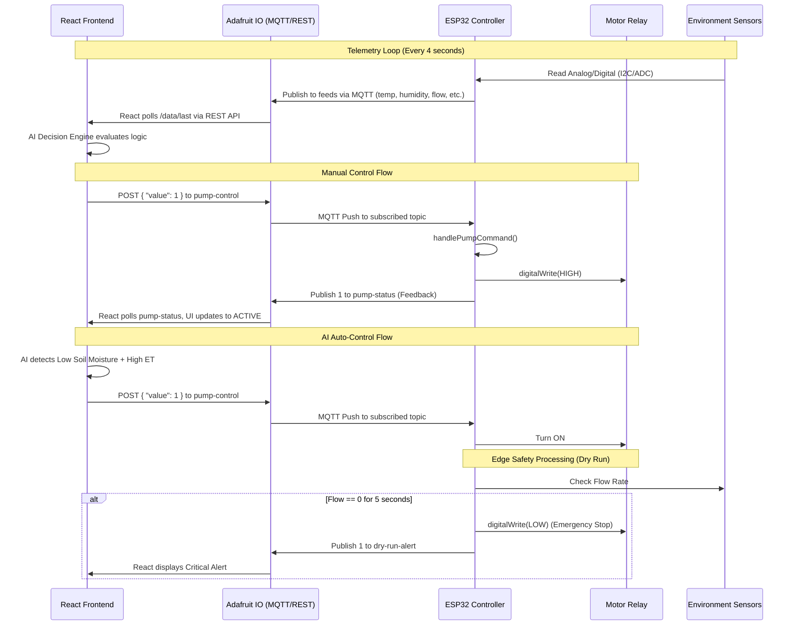

# Irrigation System Architecture

This outlines the data flow between the React Frontend, Adafruit IO, and ESP32 hardware.

## Core Components
1. **Frontend:** React application that serves as the command center. Implements AI logic for deciding when to water based on temperature, humidity (ET Index), and TDS.
2. **Adafruit IO:** The MQTT broker acting as the middleman.
3. **ESP32 Controller:** The edge device. It runs a non-blocking loop maintaining a persistent MQTT connection, reading local sensors, directly switching the relay, and detecting faults locally to ensure safety even if the internet disconnects.
